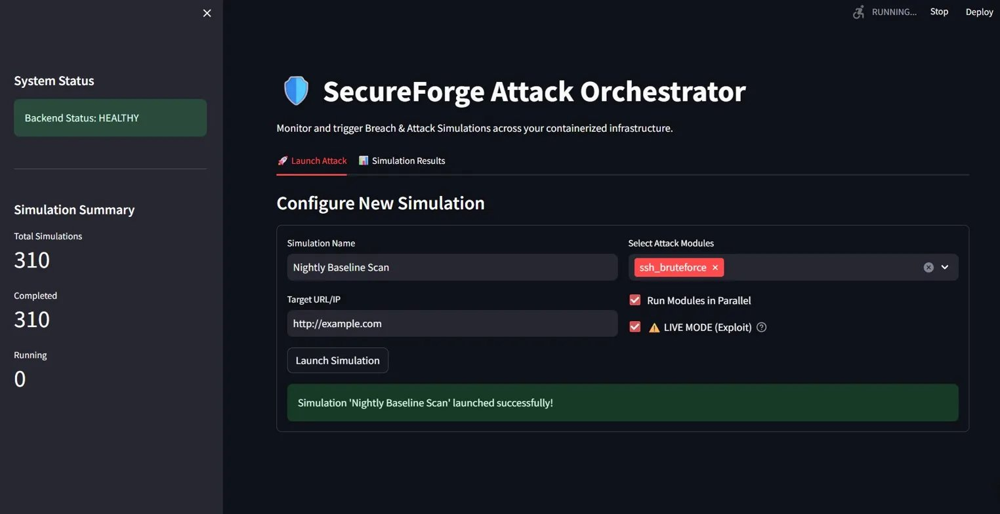
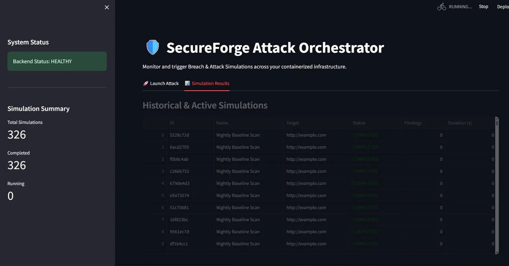
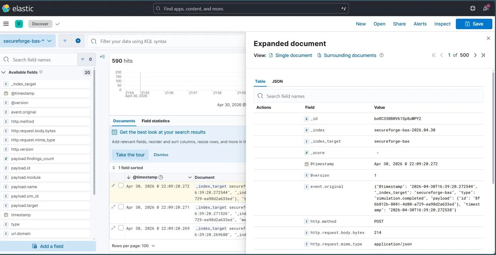
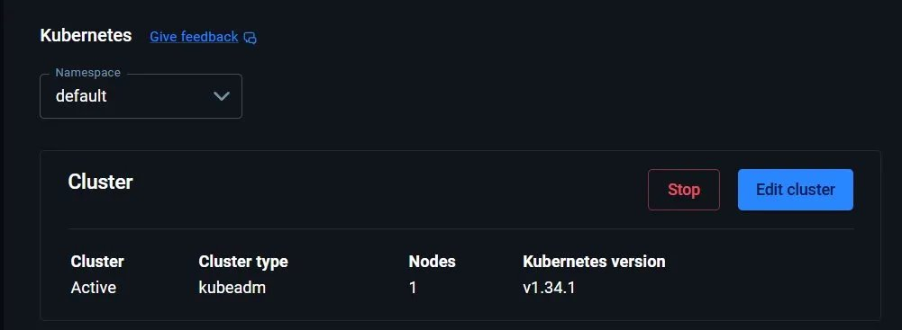

# 🛡️ SecureForge: Containerized Breach & Attack Simulation (BAS)

SecureForge is a modular, auto-scaling Breach and Attack Simulation (BAS) platform designed to safely execute, orchestrate, and monitor simulated cyber attacks across a containerized infrastructure.

It features a high-performance FastAPI attack engine, an interactive Streamlit orchestrator dashboard, and a real-time enterprise observability pipeline powered by the ELK Stack — all orchestrated within a Kubernetes cluster equipped with a Horizontal Pod Autoscaler (HPA).

---

## 📊 System Screenshots

### Attack Orchestrator Dashboard — Launch Attack



*Configuring parallel, modular attack simulations targeting internal/external infrastructure.*

---

### Attack Orchestrator Dashboard — Simulation Results



*Real-time monitoring of active and historical simulation runs.*

---

### Enterprise Observability (ELK Stack) — Kibana Discover



*Real-time ingestion and visualization of simulated vulnerabilities, mapping attack payloads to MITRE ATT&CK tactics.*

---

### Infrastructure — Kubernetes Node



*Entire architecture orchestrated locally via a Kubernetes single-node cluster (v1.34.1, kubeadm).*

---

## 🏗️ Architecture & Tech Stack

The platform is divided into four highly-decoupled architectural pillars:

### 1. BAS Engine (`FastAPI` + `Python`)
- The core execution engine. Handles asynchronous scheduling and dispatches modular attack payloads (`owasp_web`, `ssh_bruteforce`, `privilege_escalation`).
- Broadcasts real-time JSON findings to the internal event bus.

### 2. Attack Orchestrator UI (`Streamlit`)
- A dynamic frontend providing a "single pane of glass" to launch attacks, toggle live/simulation modes, and view high-level results.

### 3. Observability Pipeline (`Elasticsearch`, `Logstash`, `Kibana`)
- Logstash acts as a sink for the BAS Engine's event bus, transforming and streaming vulnerability data into Elasticsearch.
- Kibana provides the real-time SOC dashboard.

### 4. Orchestration & Auto-Scaling (`Kubernetes`)
- The entire stack is deployed via declarative K8s manifests.
- Includes a **Horizontal Pod Autoscaler (HPA)** that automatically spins up additional BAS Engine pods when CPU utilization exceeds 70% during heavy attack simulations.

---

## 🚀 Getting Started

### Prerequisites

- **Docker Desktop** installed with **Kubernetes Enabled** (Settings > Kubernetes > Enable Kubernetes).
- `kubectl` CLI installed and configured to point to the local Docker Desktop cluster:

```bash
kubectl config use-context docker-desktop
```

---

### 1. Build the Local Images

Before deploying to Kubernetes, build the engine and dashboard images locally:

```bash
# Build the BAS Engine
docker build -t secureforge-bas-engine:latest ./bas_engine

# Build the Streamlit Dashboard
docker build -t secureforge-dashboard:latest ./dashboard
```

---

### 2. Deploy the Kubernetes Architecture

Apply the manifests to spin up the namespace, ELK stack, API engine, auto-scaler, and dashboard:

```bash
kubectl apply -f kubernetes/00-namespace.yaml
kubectl apply -f kubernetes/01-elk-stack.yaml
kubectl apply -f kubernetes/02-bas-engine.yaml
kubectl apply -f kubernetes/03-hpa.yaml
kubectl apply -f kubernetes/04-dashboard.yaml
```

> **Note:** The ELK stack containers are heavy. Monitor startup progress with:
> ```bash
> kubectl get pods -n secureforge -w
> ```

---

### 3. Access the Services

Once all pods display a `Running` status, access the platform via your browser:

| Service | URL |
|---|---|
| SecureForge Dashboard | http://localhost:30850 |
| BAS Engine API (Swagger) | http://localhost:30800/api/docs |
| Kibana SOC Dashboard | http://localhost:30601 |

> **Kibana Setup:** Go to `Stack Management > Data Views > Create view` with index pattern `secureforge-bas-*` and `@timestamp` as the time field. Then navigate to `Analytics > Discover`.

---

## ⚠️ Disclaimer

**For Educational and Authorized Testing Purposes Only.**

SecureForge is designed strictly for simulating attacks against owned or explicitly authorized infrastructure. Do **not** use the `live_mode: true` exploit flag against targets you do not have legal permission to test.