# SecureForge: Enterprise Breach & Attack Simulation Platform

> **Containerized Breach & Attack Simulation platform for detection validation, SOC scoring, and adversary emulation — built on FastAPI, Next.js, and Kubernetes.**

<p align="center">
  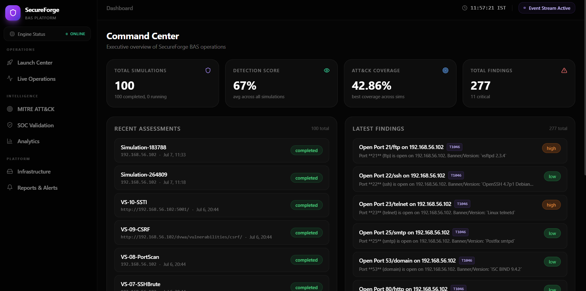
  <br><br>
  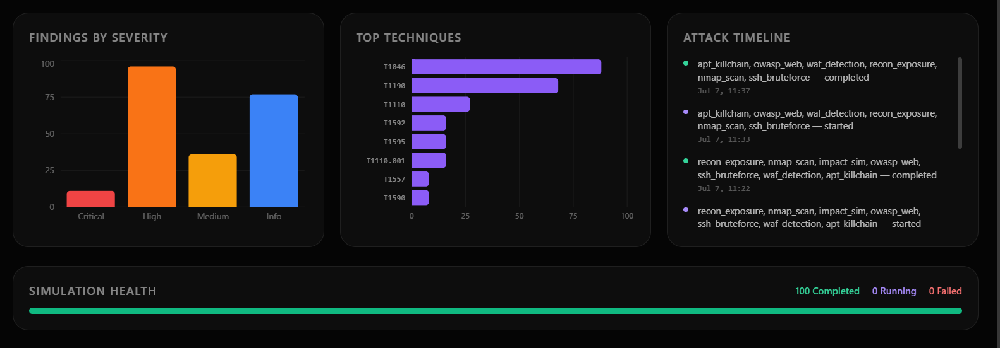
</p>

---

## Quick Start (Local Installation)

To deploy the full SecureForge platform locally for evaluation or development, ensure you have **Docker** and **Docker Compose** installed.

```bash
# 1. Clone the repository
git clone https://github.com/kushagrakushwah/bas_v3.git
cd bas_v3

# 2. Configure environment variables
cp .env.example .env

# 3. Build and launch the containerized stack
docker-compose up -d --build
```

Once the containers are running, access the platform at:

- **Frontend Dashboard:** `http://localhost:3000`
- **Backend API & Docs:** `http://localhost:8000/docs`

### Required Environment Variables

Before launching, make sure these are set in your `.env` file:

| Variable | Required | Description |
| :--- | :---: | :--- |
| `DATABASE_URL` | Yes | PostgreSQL connection string. Must use `asyncpg` driver. |
| `REDIS_URL` | Yes | Redis connection string for the Celery message broker. |
| `API_KEY` | Yes | Bearer token required to access the REST API. |
| `NEXTAUTH_SECRET` | Yes | 32-byte random string used to sign JWTs in the frontend. |
| `LOG_LEVEL` | No | Set to `DEBUG` for verbose Celery task tracing (default: `INFO`). |
| `MAX_CONCURRENT_ATTACKS` | No | Hard limit on concurrent async requests per module (default: `50`). |

### Common Setup Issues

**Simulations stuck in `PENDING`?** The Celery workers aren't running or can't reach Redis. Check with `docker logs secureforge-celery-worker-1` and verify `REDIS_URL` is correct.

**Live Telemetry stream is blank?** WebSocket connection failure. Make sure your reverse proxy (Nginx, Traefik, or AWS ALB) is configured to allow WebSocket upgrades (`Connection: Upgrade`, `Upgrade: websocket`) on the `/ws` route.

**`asyncpg.exceptions.TooManyConnectionsError`?** You've scaled Celery workers beyond what PostgreSQL can handle. Either reduce worker count or increase `max_connections` in `postgresql.conf`.

---

## 1. Executive Summary & Overview

SecureForge is a highly advanced, self-hosted **BAS (Breach & Attack Simulation) platform** designed specifically for security engineering teams that need a reliable, repeatable way to test their detection stack without touching production systems.

In the modern enterprise, deploying Endpoint Detection and Response (EDR), Security Information and Event Management (SIEM), and Web Application Firewalls (WAF) is not enough. The configurations of these tools degrade over time (configuration drift), SIEM rules become deprecated, and log ingestion pipelines fail. SecureForge exists to continuously validate that your multi-million dollar security stack is actually doing its job.

Instead of writing custom scripts for every test or paying for expensive, intermittent penetration testing, SecureForge orchestrates modular attack simulations, streams live telemetry in real-time, maps all findings to the **MITRE ATT&CK® Framework**, and dynamically scores your SOC coverage — all from a beautiful, modern web dashboard.

### 1.1 The SecureForge Philosophy
SecureForge operates on the principle of **Continuous Security Validation (CSV)**. Security is not a state; it is a process. To ensure that defenses are working, they must be tested under fire. SecureForge automates the "fire." By launching controlled, deterministic attack paths across the cyber kill chain, defenders can verify their alerts fire correctly, their playbooks are actionable, and their mean-time-to-detect (MTTD) is improving.

### 1.2 Deployment Paradigm
Unlike SaaS products that require you to whitelist external IP addresses and expose your internal network to third-party vendors, SecureForge runs **on your infrastructure, in your cluster, against your environment**. This guarantees 100% visibility and zero data exfiltration risks. You own the telemetry, you own the logs, and you own the data.

> **Authorization Required:** This platform is intended for use in authorized environments only. Please read the Legal Disclaimer at the bottom of this document before deploying SecureForge against any target.

---

## 2. Platform Walkthrough & Interface

SecureForge features a state-of-the-art UI built on Next.js and TailwindCSS. Below is a detailed walkthrough of the platform interfaces, utilizing dual-view screenshots to showcase the full depth of the application.

### 2.1 Command Center (Dashboard)
The Command Center is the executive hub of the platform. It provides a high-level view of all active and historical simulations, aggregate detection scores, and overall MITRE ATT&CK coverage metrics.
<p align="center">
  
  <br><br>
  
</p>

### 2.2 Launch Pad
The Launch Pad is where operators configure and deploy new attack simulations. It features a dense matrix of available attack modules across various tactics (Reconnaissance, Web Exploitation, Credential Access, etc.). Operators can define targets, select specific modules, and launch the operation asynchronously.
<p align="center">
  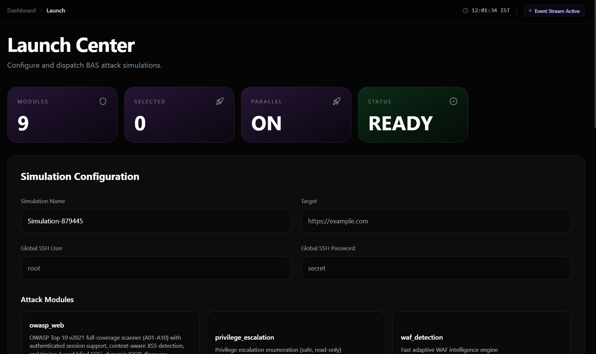
  <br><br>
  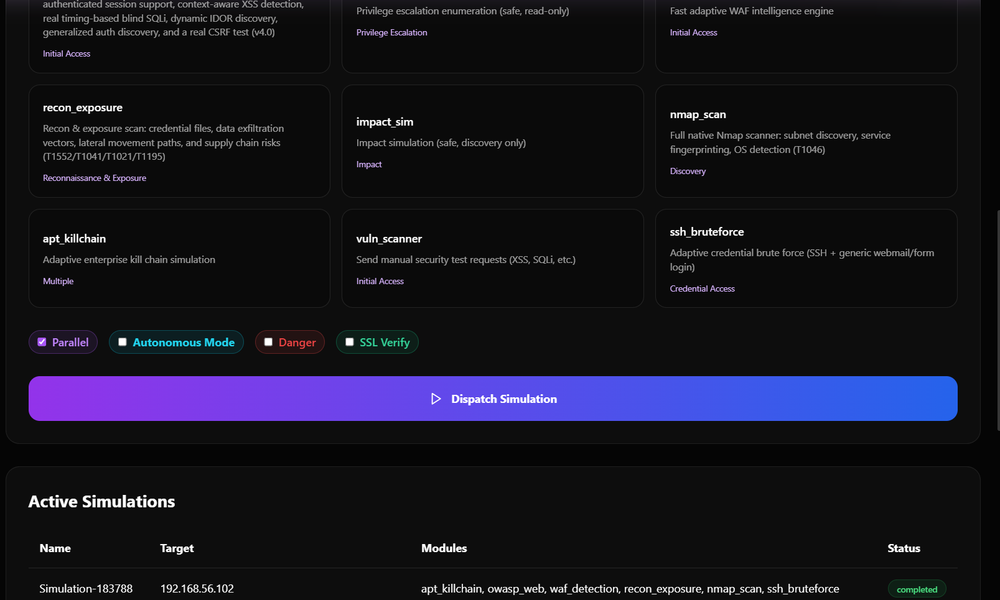
</p>

### 2.3 Live Telemetry (Live Operations)
Live Operations provides a granular, real-time WebSocket stream of the attack as it happens. Every HTTP request, SSH brute-force attempt, and payload delivery is logged and streamed instantly to the UI, allowing operators to monitor the exact actions the engine is taking against the target.
<p align="center">
  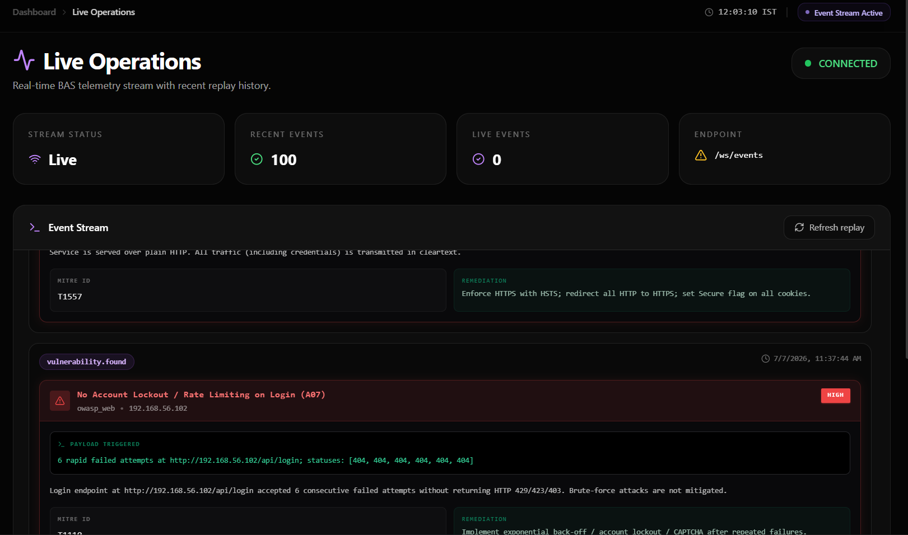
  <br><br>
  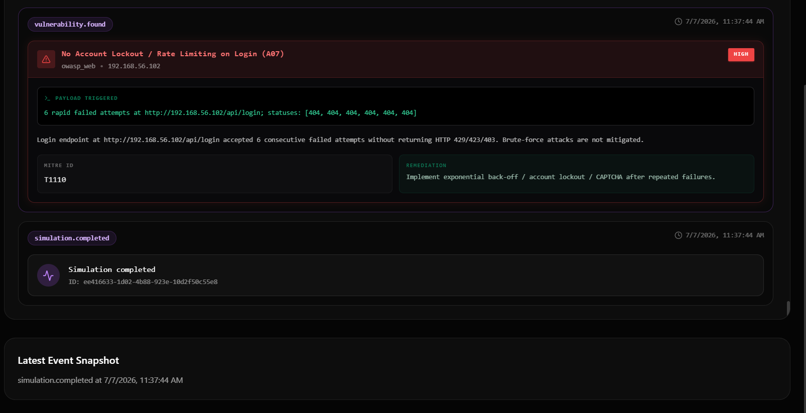
</p>

### 2.4 MITRE ATT&CK Heatmap
This interface visually maps all simulation findings to the official MITRE ATT&CK matrix. Techniques that were successfully exploited are highlighted in red (Critical/High), while mitigated or untested techniques are grayed out. This provides immediate visual feedback on organizational blind spots.
<p align="center">
  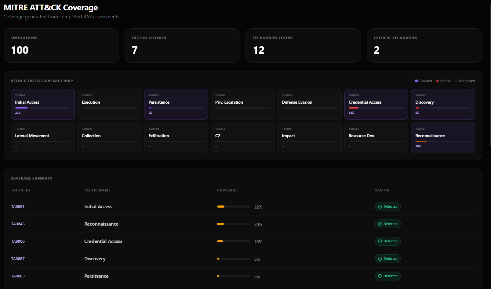
  <br><br>
  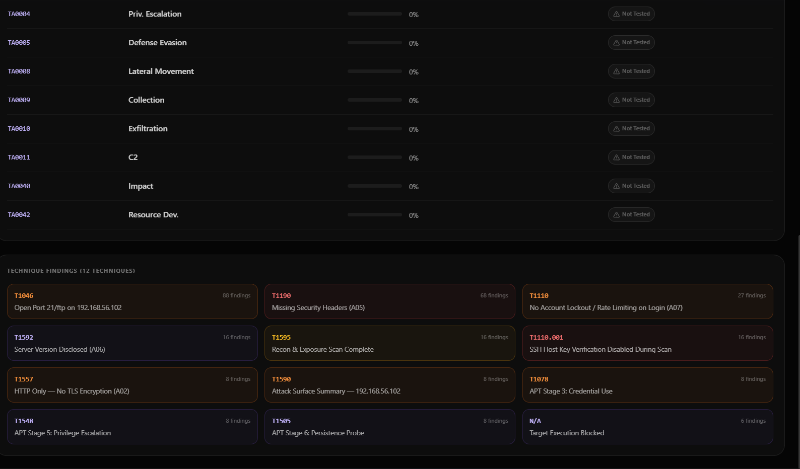
</p>

### 2.5 SOC Scoring & Validation
The SOC Validation page correlates the results of the attack simulations with your internal defensive posture. It grades the environment based on NIST Maturity Tiers, calculates an overall Detection Score, and provides Sigma rules for any detected blind spots so defenders can immediately implement new SIEM alerts.
<p align="center">
  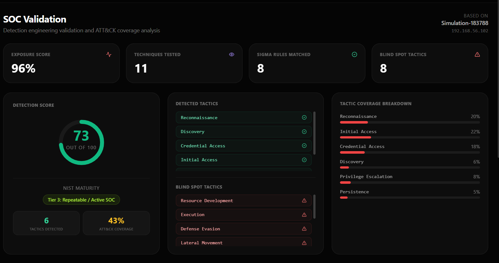
  <br><br>
  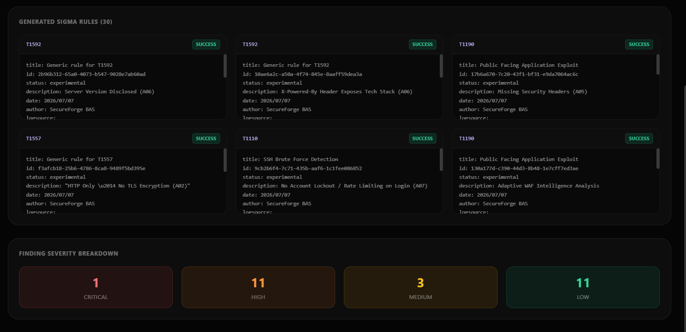
</p>

### 2.6 Analytics
The Analytics module provides in-depth data interrogation and trend analysis. It tracks historical performance, vulnerability remediation velocity, and recurring systemic weaknesses across multiple simulation campaigns over time.
<p align="center">
  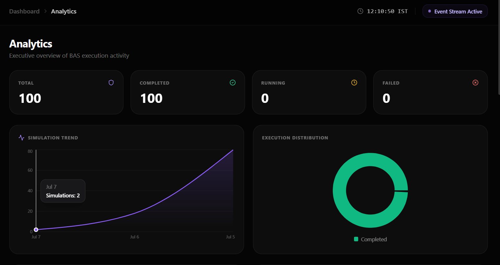
  <br><br>
  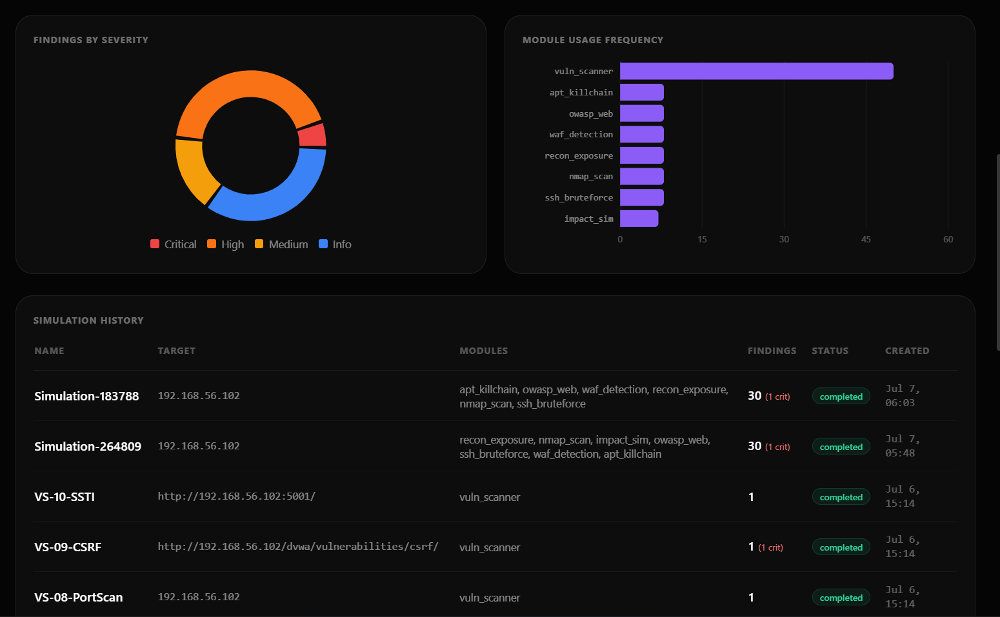
</p>

### 2.7 Infrastructure Management
This page offers configuration management for the platform's distributed architecture. It displays the health of the underlying Kubernetes pods, Celery workers, PostgreSQL database connections, Redis queues, and third-party API integration statuses.
<p align="center">
  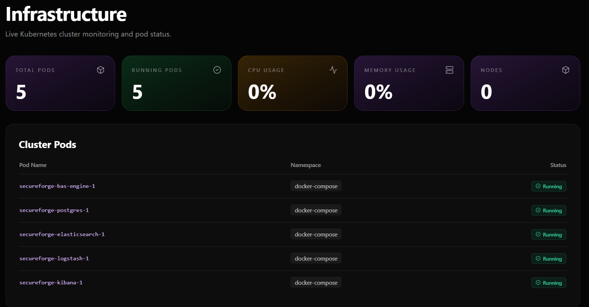
</p>

### 2.8 Reports & Alerts
The centralized repository for generated compliance and technical reports. This tab also manages asynchronous alert pipelines, allowing operators to configure Slack, Teams, or email notifications for critical simulation findings.
<p align="center">
  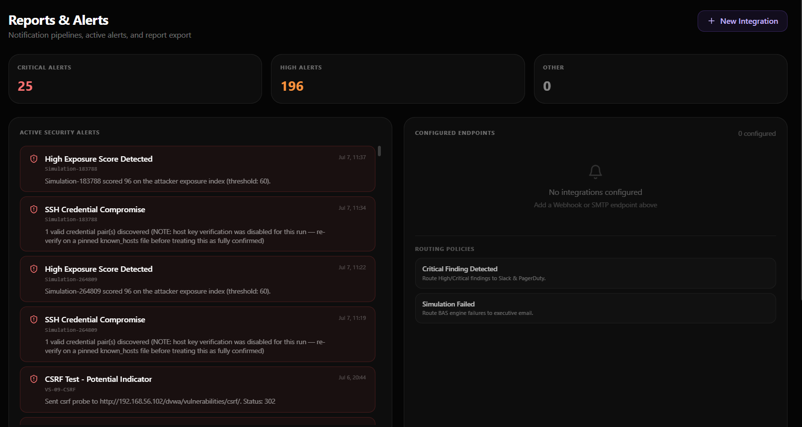
  <br><br>
  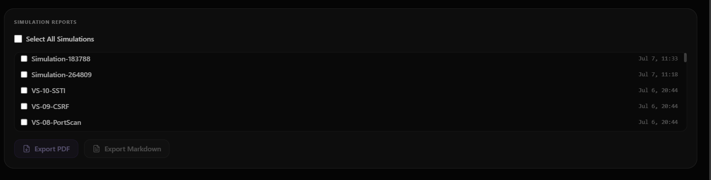
</p>

---

## 3. Comprehensive Architecture Deep Dive

SecureForge utilizes a deeply decoupled, highly asynchronous microservices architecture to ensure maximum scalability and reliability during resource-intensive, concurrent simulations.

```text
┌──────────────────────────────────────────────────────┐
│                  secureforge-frontend                │
│         (Next.js / TypeScript / TailwindCSS)         │
│  Dashboard │ Launch │ Realtime │ Reports │ Analytics │
│  Alerts │ MITRE │ SOC │ Infrastructure               │
└───────────────────┬──────────────────────────────────┘
                    │ HTTP REST + WebSockets (Socket.io)
┌───────────────────▼──────────────────────────────────┐
│                    bas_engine                        │
│                  (FastAPI / Python 3.10)             │
│  Attack Orchestrator │ Event Bus │ Finding Store     │
│  Simulation Runner │ Validation │ WS Broadcaster     │
│  Kubernetes Client │ Metrics API │ ELK Forwarder     │
└──────┬─────────────────────────────────┬─────────────┘
       │ Task Queue (Celery via Redis)   │ Logs
┌──────▼──────┐                 ┌────────▼────────┐
│  Distributed│                 │   ELK Stack     │
│   Workers   │                 │ Elasticsearch   │
│  (Celery/   │                 │ Logstash        │
│   Redis)    │                 │ Kibana          │
└─────────────┘                 └─────────────────┘
       │ SQLAlchemy / AsyncPG
┌──────▼──────┐
│ PostgreSQL  │
│ (State/DB)  │
└─────────────┘
```

### 3.1 The Frontend (secureforge-frontend)
Built on **Next.js 14**, the frontend utilizes React Server Components (RSC) alongside traditional client-side hooks to deliver a blazing-fast user experience.
- **Styling:** TailwindCSS is used exclusively for utility-first styling, enabling the sleek, dark-mode-first aesthetic (Glassmorphism, deep violets, and emerald accents).
- **State Management:** React hooks (`useState`, `useEffect`) and context providers manage the complex state required for the MITRE ATT&CK grid and active simulations.
- **Real-time Engine:** The frontend maintains a persistent WebSocket connection to the backend, rendering streaming logs directly into the terminal UI of the Live Operations page.

### 3.2 The Backend Gateway (bas_engine)
The core API is powered by **FastAPI**. It is an asynchronous, high-throughput gateway that handles all REST requests and WebSocket connections.
- **Orchestrator:** When a user launches a simulation, the FastAPI orchestrator translates the request into a series of highly decoupled tasks.
- **WebSockets:** Uses `asyncio` and `websockets` to broadcast live event payloads (e.g., `[OWASP] Probing http://...`) to all connected frontend clients.
- **Validation Engine:** Contains the logic to cross-reference raw findings against the MITRE ATT&CK framework and calculate complex metrics like the SOC Detection Score.

### 3.3 The Distributed Worker Fleet (Celery & Redis)
Because network scanning, fuzzing, and brute-forcing are highly I/O bound and computationally expensive, they cannot run within the FastAPI event loop.
- **Redis:** Acts as the message broker. When the API receives a simulation request, it pushes the job onto a Redis queue.
- **Celery Workers:** Independent Python processes running in separate Docker containers. They pull jobs off the Redis queue and execute the actual attack scripts (`owasp_web.py`, `nmap_scan.py`, etc.).
- **Scalability:** You can easily scale the number of Celery worker containers to run dozens of simulations concurrently across hundreds of targets without degrading the API performance.

### 3.4 Data Persistence & Observability
- **PostgreSQL:** The primary relational database. Accessed via SQLAlchemy 2.0 and `asyncpg`. Stores user profiles, simulation configurations, raw findings, and generated metadata.
- **Elasticsearch (Optional Integration):** The backend can forward raw attack telemetry to an external ELK stack, allowing threat hunters to correlate SecureForge's attack logs with their own SIEM logs in Kibana.

---

## 4. SOC Validation & Scoring Methodology

SecureForge doesn't just execute attacks; it tells you how well you would have detected them. The SOC Validation Engine is a core component that analyzes the raw output of a simulation and generates actionable metrics.

### 4.1 The Detection Score Algorithm
The Detection Score (0-100%) is an aggregate metric that evaluates the organization's theoretical capability to detect the specific chain of techniques that were just executed.
The engine calculates this by:
1. Extracting all unique MITRE technique IDs (`T1190`, `T1059.007`, etc.) from the simulation findings.
2. Querying the internal `BlindspotAnalyzer` to determine which of those techniques are historically "blind spots" (techniques that the organization lacks SIEM rules for).
3. Applying a weighted penalty for Critical and High severity findings that fall into those blind spots.
4. Outputting a final percentage representing the SOC's estimated visibility into the attack.

### 4.2 NIST Incident Response Maturity Tiers
Based on the Detection Score and the breadth of the tactics covered, the engine assigns a NIST-aligned maturity tier:
- **Tier 1: Minimal (0-39%):** The organization is entirely reactive. Log collection is sparse, and alerts are practically non-existent.
- **Tier 2: Developing (40-69%):** Basic log aggregation exists. Some critical alerts fire, but significant blind spots remain, particularly in lateral movement and defense evasion.
- **Tier 3: Evolving (70-89%):** Proactive threat hunting is possible. Strong coverage across the kill chain.
- **Tier 4: Optimized (90-100%):** Advanced, automated response capabilities. Deep visibility into execution and persistence mechanisms.

### 4.3 Automated Sigma Rule Generation
When the engine identifies a blind spot (e.g., the target was vulnerable to a specific PowerShell execution technique), it doesn't just report the failure. SecureForge automatically cross-references the technique against an internal library of Sigma rules and provisions the exact YAML configuration required to build an alert in Splunk, Elastic, or Sentinel.

---

## 5. The Attack Arsenal (18 Modules Deep Dive)

SecureForge comes packed with **18 highly detailed, production-grade attack modules** split across two main categories. Each module is designed to be deterministic, safe for production environments, and highly configurable.

### 5.1 Red Team & Network Emulation Modules

#### 5.1.1 APT Killchain (Autonomous Scenario)
**MITRE Tactics:** Initial Access (TA0001), Execution (TA0002), Persistence (TA0003), Privilege Escalation (TA0004), Credential Access (TA0006), Discovery (TA0007), Lateral Movement (TA0008).
**Description:** The APT Killchain is the crown jewel of SecureForge. It is a terrifying, 7-stage autonomous attack that simulates an Advanced Persistent Threat (APT). It does not rely on a static script; instead, it dynamically adapts to the target. It automatically chains together Reconnaissance, Credential Brute-forcing, Web Exploitation, Privilege Escalation probes, and Persistence mechanisms in one massive simulation. If the initial web exploit succeeds, it immediately pivots to credential harvesting, feeding those credentials back into its lateral movement engine.

#### 5.1.2 Nmap Subnet Scan & Discovery
**MITRE Tactics:** Discovery (TA0007)
**Description:** Automates comprehensive network discovery. It executes aggressive (`-A`) TCP SYN scans against the target infrastructure to discover active hosts, identify open ports, and fingerprint running services and OS versions. It is essential for mapping the internal attack surface and validating that internal network segmentation (VLANs, Firewalls) is functioning correctly.

#### 5.1.3 SSH Bruteforce & Credential Stuffing
**MITRE Tactics:** Credential Access (TA0006)
**Description:** Tests the resilience of infrastructure credentials. Using a highly optimized, asynchronous SSH client, this module performs dictionary attacks against target servers. It utilizes custom wordlists to emulate password spraying (testing a few common passwords against many accounts) and credential stuffing (testing known compromised passwords). It also checks for the lack of rate-limiting or Fail2Ban configurations.

#### 5.1.4 Reconnaissance & Exposure (OSINT)
**MITRE Tactics:** Reconnaissance (TA0043)
**Description:** A passive intelligence-gathering module. It queries public DNS records, Certificate Transparency (CT) logs, and Shodan APIs to map the external attack surface of the organization. It identifies forgotten subdomains, expired SSL certificates, and publicly exposed administrative interfaces (like RDP or unauthenticated Elasticsearch clusters) without ever touching the target network directly.

#### 5.1.5 WAF Evasion & Detection
**MITRE Tactics:** Defense Evasion (TA0005)
**Description:** Specifically designed to test the efficacy of Web Application Firewalls (like Cloudflare, AWS WAF, or Imperva). It fires a barrage of mutated payloads (e.g., heavily encoded SQLi strings, fragmented HTTP requests, and obfuscated cross-site scripting vectors) to determine exactly which payloads bypass the filter. It fingerprints the WAF based on HTTP response headers and block pages.

#### 5.1.6 Privilege Escalation Simulator
**MITRE Tactics:** Privilege Escalation (TA0004)
**Description:** Simulates an attacker who has gained low-privileged access to a system. It checks for common misconfigurations that allow escalation to root/SYSTEM, such as overly permissive `sudo` rights, vulnerable SUID binaries, unquoted service paths in Windows, and exposed Docker sockets.

#### 5.1.7 Impact & Destruction Simulator
**MITRE Tactics:** Impact (TA0040)
**Description:** Emulates ransomware and wiper malware behavior in a completely safe, sandboxed manner. It tests if the EDR solution detects rapid file encryption patterns, mass file deletions, or attempts to stop critical system recovery services (like deleting Volume Shadow Copies via `vssadmin`).

#### 5.1.8 Active Directory Recon
**MITRE Tactics:** Discovery (TA0007), Credential Access (TA0006)
**Description:** Queries the Domain Controller via LDAP to dump user lists, identify domain admins, and check for kerberoastable accounts (accounts with SPNs set).

### 5.2 Vulnerability Scanner Modules (AppSec)

#### 5.2.1 OWASP Web Scanner (Comprehensive)
**MITRE Tactics:** Initial Access (TA0001)
**Description:** A monolithic web scanner that acts as a baseline check. It crawls the target application and analyzes the responses for low-hanging fruit: missing security headers (HSTS, CSP), exposed server version banners (e.g., `nginx/1.4.2`), TLS downgrade vulnerabilities, and directory indexing.

#### 5.2.2 SQL Injection (SQLi)
**MITRE Tactics:** Initial Access (TA0001), Credential Access (TA0006)
**Description:** Tests for database flaws. It doesn't just look for syntax errors; it utilizes time-based blind SQLi payloads (e.g., `WAITFOR DELAY '0:0:10'`) and boolean-based inferences to confirm extraction vectors without crashing the application.

#### 5.2.3 Cross-Site Scripting (XSS)
**MITRE Tactics:** Initial Access (TA0001)
**Description:** Injects heavily obfuscated JavaScript payloads into URL parameters, form fields, and HTTP headers to test for both Reflected and Stored XSS. It attempts to bypass common XSS filters by utilizing polyglot payloads that execute across multiple HTML contexts.

#### 5.2.4 Command Injection (CMDi)
**MITRE Tactics:** Execution (TA0002)
**Description:** Targets endpoints that pass user input to the underlying operating system shell. It injects bash and PowerShell metacharacters (`;`, `|`, `&&`, `$()`) to attempt out-of-band (OOB) DNS lookups or delayed execution, confirming arbitrary code execution capabilities.

#### 5.2.5 Path Traversal (LFI/RFI)
**MITRE Tactics:** Initial Access (TA0001), Discovery (TA0007)
**Description:** Attempts to break out of the designated web root directory by injecting dot-dot-slash (`../../`) sequences and URL-encoded variants. It targets sensitive files like `/etc/passwd` on Linux or `C:\Windows\win.ini` on Windows, confirming Local File Inclusion (LFI).

#### 5.2.6 XML External Entity (XXE)
**MITRE Tactics:** Initial Access (TA0001)
**Description:** Identifies endpoints that parse XML. It injects malicious DOCTYPE definitions defining external entities. It attempts to force the XML parser to read local system files or initiate HTTP requests to attacker-controlled infrastructure (SSRF via XXE).

#### 5.2.7 Server-Side Request Forgery (SSRF)
**MITRE Tactics:** Initial Access (TA0001), Lateral Movement (TA0008)
**Description:** Specifically targets the internal network from the perspective of the web server. It attempts to make the server query internal cloud metadata endpoints (e.g., the AWS IMDSv2 at `169.254.169.254`), internal administration panels (e.g., `http://localhost:8080`), or internal Redis instances.

#### 5.2.8 Cross-Site Request Forgery (CSRF)
**MITRE Tactics:** Initial Access (TA0001)
**Description:** Analyzes state-changing HTTP requests (POST, PUT, DELETE) to determine if they are protected by anti-CSRF tokens or `SameSite` cookie attributes, verifying if an attacker could trick an authenticated user into performing unwanted actions.

#### 5.2.9 Server-Side Template Injection (SSTI)
**MITRE Tactics:** Execution (TA0002)
**Description:** Probes modern templating engines (Jinja2, Twig, Freemarker) by injecting mathematical expressions (e.g., `{{7*7}}`). If the server evaluates the expression and returns `49`, the module escalates to attempt Remote Code Execution (RCE) by accessing underlying template environment objects.

### 5.3 Payload Generation Engine
Rather than relying on static wordlists for injection payloads, SecureForge utilizes a dynamic payload generation engine. When an attack module runs, it requests a mutated payload from the engine. The engine uses contextual information about the target (e.g., if the target is Windows, it generates PowerShell payloads instead of bash; if the target is running MySQL, it generates MySQL-specific syntax). This greatly increases the chance of bypassing signature-based detection.

---

## 6. Comprehensive API Reference

SecureForge provides a full, unauthenticated REST API for programmatic control of the platform. All endpoints return JSON. Below is a subset of the critical endpoints. For the full interactive OpenAPI documentation, visit `http://localhost:8000/docs` while the engine is running.

### 6.1 Simulation Management

#### `POST /api/v1/simulations`
**Description:** Launches a new simulation asynchronously.
**Request Body:**
```json
{
  "name": "Quarterly PCI-DSS Network Sweep",
  "target_scope": ["192.168.1.0/24", "10.0.0.5"],
  "modules": ["nmap_scan", "ssh_bruteforce"],
  "intensity": "high"
}
```
**Response (202 Accepted):** Returns the `simulation_id` which can be used to query status.

#### `GET /api/v1/simulations/{id}`
**Description:** Retrieves the current status, progress, and metadata for a specific simulation.

#### `DELETE /api/v1/simulations/{id}`
**Description:** Immediately sends a cancellation signal to all Celery workers executing tasks for this simulation, cleanly aborting the attack.

### 6.2 Module Introspection

#### `GET /api/v1/modules`
**Description:** Returns a detailed list of all available attack modules, including their expected parameters, MITRE mappings, and default timeouts.

### 6.3 Findings & Analytics

#### `GET /api/v1/simulations/{id}/findings`
**Description:** Retrieves a paginated list of all vulnerabilities and successful exploits discovered during a specific simulation.
**Query Parameters:** `severity` (filter by critical/high/medium/low), `mitre_id` (filter by technique).

#### `GET /api/v1/analytics/soc-score`
**Description:** Returns the aggregate SOC Detection Score and NIST Maturity Tier calculated across all historical simulations.

---

## 7. Data Models & Schema

The platform relies on a strict schema implemented via Pydantic (for the API) and SQLAlchemy (for PostgreSQL).

### 7.1 The `Simulation` Entity
The core entity tracking the lifecycle of an attack campaign.
* `id` (UUID): Primary key.
* `name` (String): Human-readable name.
* `status` (Enum): `PENDING`, `RUNNING`, `COMPLETED`, `FAILED`, `CANCELLED`.
* `target_scope` (JSONB): The list of IPs, CIDRs, or URLs being targeted.
* `start_time` (DateTime) & `end_time` (DateTime).

### 7.2 The `Finding` Entity
Represents a single successful exploit or discovered vulnerability.
* `id` (UUID): Primary key.
* `simulation_id` (UUID): Foreign key linking back to the simulation.
* `module_name` (String): The module that generated this finding (e.g., `owasp_web`).
* `severity` (Enum): `CRITICAL`, `HIGH`, `MEDIUM`, `LOW`, `INFO`.
* `mitre_id` (String): The specific technique mapped (e.g., `T1190`).
* `description` (Text): Detailed explanation of the finding.
* `evidence` (JSONB): The raw HTTP response, SSH banner, or command output proving the vulnerability exists.

---

## 8. Enterprise Deployment & Scaling Guide

While the quick start uses a standard `docker-compose.yml`, deploying SecureForge in a production enterprise environment requires a more robust architecture, typically involving Kubernetes (K8s).

### 8.1 Scaling the Celery Worker Fleet
If you are running simulations against thousands of IP addresses, a single Celery worker will become a bottleneck. You can scale the workers horizontally:

**Docker Compose:**
```bash
docker-compose up -d --scale celery_worker=10
```
This will spin up 10 independent worker containers, all pulling from the same Redis queue.

**Kubernetes (HPA):**
In a K8s environment, the `celery-worker` deployment should be configured with a Horizontal Pod Autoscaler (HPA) targeting CPU utilization. As the Redis queue fills up during a massive simulation, the HPA will automatically spin up additional worker pods to handle the load.

### 8.2 Database Tuning
For large environments, the PostgreSQL database must be tuned to handle high-frequency writes (as findings and logs are continuously streamed in).
* Increase `max_connections` to at least 500.
* Increase `shared_buffers` to 25% of available RAM.
* Increase `work_mem` to prevent complex analytic queries from spilling to disk.

### 8.3 ELK Stack Forwarding
To integrate with your existing SIEM:
1. Ensure the `ELASTICSEARCH_URL` is set in the `.env` file.
2. The `bas_engine` will automatically instantiate an asynchronous forwarder that pushes all attack telemetry (every HTTP request made, every payload fired) to an index named `secureforge-telemetry-*`.
3. Use the provided Kibana dashboard templates (found in `/dashboards`) to visualize the attack traffic alongside your defensive logs.

---

## 9. Security Considerations for the Platform

Deploying an offensive security tool on your network requires careful consideration of the platform's own security posture.

1. **Network Isolation:** SecureForge should be deployed on an isolated management VLAN. It needs routing access to the targets it is testing, but general corporate users should not have routing access to the SecureForge frontend or API.
2. **Authentication:** The frontend utilizes NextAuth.js. Ensure strong passwords and consider integrating it with your corporate SSO (SAML/OIDC) if deploying in production.
3. **API Key Rotation:** The `API_KEY` used for backend communication should be rotated regularly.
4. **Data Retention:** Simulation findings contain highly sensitive vulnerability data. Ensure the PostgreSQL volume is encrypted at rest (e.g., using AWS EBS encryption or LUKS) and implement a data retention policy to purge old simulation data via the API.

---

## 10. Legal Disclaimer

SecureForge is an offensive security tool designed exclusively for authorized testing and educational purposes. Usage of this tool for attacking targets without prior mutual consent is strictly prohibited and likely illegal. It is the end user's responsibility to obey all applicable local, state, and federal laws. The developers, contributors, and affiliated organizations assume no liability and are not responsible for any misuse, damage, or data loss caused by this program.

**By deploying this software, you acknowledge that you have explicit authorization to test the target environments and understand the risks associated with automated breach and attack simulation.**

---
